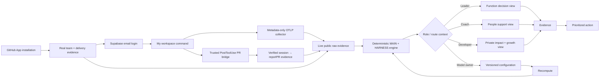

# Prism architecture flow

This is the real-only user and evidence flow. GitHub defines the team, Supabase Auth links a login to one discovered employee, and that developer explicitly connects Codex or Claude Code. The deterministic scoring boundary remains unchanged.

## Alignment

- `services/engine` remains the only owner of index calculations.
- Every product route reads real `public.*` rows through the authenticated RLS client; connector and pipeline writes use narrowly scoped service-role paths.
- GitHub installation is organization/account-level. Codex and Claude Code are connected per person through a hashed one-time invite and a personal collector token.
- A login claims only an active, unclaimed employee whose normalized email exactly matches the Supabase user. The first linked real user bootstraps the initial admin role.
- Hosted login uses a Supabase-generated single-use token delivered by Resend to a Prism callback; local fallback uses Supabase email delivery. Supabase remains the session authority in both cases.
- The OTLP boundary allowlists session/model/token/turn/prompt-length/success metadata and discards bodies plus unknown attributes before persistence.
- The same one-time installer adds a provider-specific `PostToolUse(Bash)` hook beside OTLP. It inspects the lifecycle envelope locally but sends only session ID, repo, and PR number; Prism resolves the hashed personal connection, requires the repo in both internal scopes, verifies the PR through the GitHub App, and links only an exact `(connection, session, repo, PR)` match.
- The web app may derive presentation labels, counts, sorting, and prioritization from already-computed rows; it may not recalculate scores.
- The agent coaching flow consumes deterministic facts and produces grounded narrative only.
- Configuration remains append-only: save a version, then recompute all views.

## Gates at a glance

| Gate | Enforcer | Threshold / behavior |
|---|---|---|
| MAIN publish | deterministic engine | confidence at least 0.40 |
| MAIN L0 | deterministic engine | AI-assisted share below 15% |
| MAIN L5 | deterministic engine | multiplier signal required |
| HARNESS | deterministic engine | separate index and confidence; never mixed into MAIN |
| Agent grounding | agent pipeline | unsupported numeric claims are repaired once, then dropped |

## File index

| Stage | Owner files |
|---|---|
| Shell and navigation | `apps/web/components/layout/*` |
| Live connection setup | `apps/web/app/(views)/connect/page.tsx`, `apps/web/components/connect/ConnectClient.tsx` |
| Personal OTLP ingest | `apps/web/app/api/connect/telemetry/**`, `apps/web/lib/connectors/telemetry/**` |
| Exact session → PR enrichment | `apps/web/app/api/connect/telemetry/pr-link/route.ts`, `apps/web/lib/connectors/pr-link/**`, `apps/web/lib/connectors/link/ai-to-pr.ts` |
| Connection schema | `apps/web/supabase/migrations/0034_connect_mvp.sql` |
| PR-link evidence schema | `apps/web/supabase/migrations/0035_pr_link_ingest.sql` |
| Function view | `apps/web/app/(views)/function/page.tsx` |
| Team and member views | `apps/web/app/(views)/team/**` |
| Supabase identity linking | `apps/web/lib/auth/session.ts`, `workspace.ts`, `apps/web/app/auth/**` |
| Private workspace | `apps/web/app/(views)/me/page.tsx`, `apps/web/components/connect/WorkspaceTelemetryCard.tsx` |
| Model configuration | `apps/web/app/(views)/configure/page.tsx` |
| Real-data reads | `apps/web/lib/db/**`, `apps/web/lib/connectors/telemetry/store.ts` |
| Deterministic scoring | `services/engine` |
