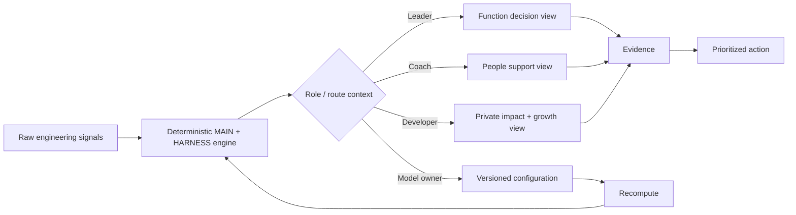

# Prism architecture flow

This is the user-facing decision flow. The rebuild changes presentation and navigation only: it does not add a service, database table, dependency, or scoring rule.

## Alignment

- `services/engine` remains the only owner of index calculations.
- `apps/web/lib/v3/read.ts` and `rollup.ts` remain the read/display boundary.
- The web app may derive presentation labels, counts, sorting, and prioritization from already-computed rows; it may not recalculate scores.
- The agent coaching flow consumes deterministic facts and produces grounded narrative only.
- Configuration remains append-only: save a version, then recompute all views.

## Gates at a glance

| Gate | Enforcer | Threshold / behavior |
|---|---|---|
| MAIN publish | deterministic engine | confidence at least 0.40 |
| MAIN L0 | deterministic engine | AI-assisted share below 15% |
| MAIN L5 | deterministic engine | multiplier signal required |
| HARNESS | deterministic engine | separate index and confidence; never mixed into MAIN |
| Agent grounding | agent pipeline | unsupported numeric claims are repaired once, then dropped |

## File index

| Stage | Owner files |
|---|---|
| Shell and navigation | `apps/web/components/layout/*` |
| Function view | `apps/web/app/(views)/function/page.tsx` |
| Team and member views | `apps/web/app/(views)/team/**` |
| Private workspace | `apps/web/app/(views)/me/page.tsx`, `apps/web/components/v3/MyView.tsx` |
| Model configuration | `apps/web/app/(views)/configure/page.tsx`, `ConfigureTable.tsx` |
| Reads and rollups | `apps/web/lib/v3/read.ts`, `rollup.ts` |
| Deterministic scoring | `services/engine` |
