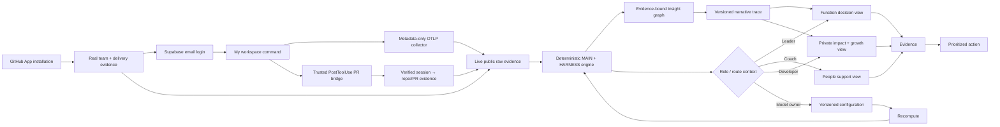

# Prism architecture flow

This is the real-only user and evidence flow. GitHub defines the team, Supabase Auth links a login to one discovered employee, and that developer explicitly connects Codex or Claude Code. The deterministic scoring boundary remains unchanged.

## Alignment

- `services/engine` remains the only owner of index calculations.
- Every product route reads real `public.*` rows through the authenticated RLS client; connector and pipeline writes use narrowly scoped service-role paths.
- GitHub installation is organization/account-level. Codex and Claude Code are connected per person through a hashed one-time invite and a personal collector token.
- A login claims only an active, unclaimed employee whose normalized email exactly matches the Supabase user. The first linked real user bootstraps the initial admin role.
- Hosted login uses a Supabase-generated single-use token delivered by Resend to a Prism callback; local fallback uses Supabase email delivery. Supabase remains the session authority in both cases.
- The OTLP boundary allowlists session/model/token/turn/prompt-length/success metadata and discards bodies plus unknown attributes before persistence.
- The same one-time installer adds a provider-specific `PostToolUse(Bash)` hook beside OTLP. It inspects the lifecycle envelope locally but sends only session ID, repo, and PR number; Prism resolves the hashed personal connection, requires the repo in both internal scopes, verifies the PR through the GitHub App, and links only an exact `(connection, session, repo, PR)` match.
- The web app may derive presentation labels, counts, sorting, and prioritization from already-computed rows; it may not recalculate scores.
- The agent coaching flow consumes deterministic facts and produces grounded narrative only.
- Each narrative lane sends its ranked candidate set in one structured call; validation remains per item, and only rejected items enter a single shared repair call. This keeps failure isolation while bounding pipeline latency.
- The three independent scope lanes (opportunities, strengths, and measured changes) fan out with maximum concurrency three. Calls are capped at 4,096 output tokens and a 45-second provider timeout; two consecutive scope failures open a circuit breaker for the remainder of the run.
- Structured output carries the exact deterministic candidate id. Persistence joins by that id—not array position—and ranks against the weights/anchors for the exact `index_daily.config_version` stamped on the score.
- Same-day reruns are coherent snapshots: new rows upsert first, then obsolete scope/date/kind/rank slots are removed. Database errors propagate and never masquerade as empty evidence.
- Organization insight prompts receive privacy-safe aggregate KPI facts only: median, contributing-person coverage, signal totals, and measured movement. Employee ids and employee narratives never enter the organization prompt.
- New insight rows carry a versioned trace in `insights.evidence_jsonb`: candidate, cited evidence snapshot, structured output, confidence reason, repair-safe validation record, and stage ledger. Prompt and response text is never retained.
- Recommendations remain deterministic. At most three active recommendations are selected per employee, and every new row includes an action, expected signal, later verification plan, and do-no-harm guard in `recommendations.evidence_jsonb`.
- Configuration remains append-only: save a version, then recompute all views.

## Gates at a glance

| Gate | Enforcer | Threshold / behavior |
|---|---|---|
| MAIN publish | deterministic engine | confidence at least 0.40 |
| MAIN L0 | deterministic engine | AI-assisted share below 15% |
| MAIN L5 | deterministic engine | multiplier signal required |
| HARNESS | deterministic engine | separate index and confidence; never mixed into MAIN |
| Agent grounding | agent pipeline | unsupported numeric claims are repaired once, then dropped |
| Agent candidate ownership | agent pipeline | exact KPI/movement/PR id must resolve before persistence; positional ownership is forbidden |
| Provider budget | agent pipeline | 45s per request, one LangChain retry, no nested SDK retry, 4,096 output tokens |
| Organization insight privacy | insight assembler | no employee identities or employee narratives enter organization prompts |
| Overview insight count | insight assembler | at most 3 strengths + 3 opportunities |
| Active coaching load | recommendation engine | at most 3 open recommendations per employee |

## File index

| Stage | Owner files |
|---|---|
| Shell and navigation | `apps/web/components/layout/*` |
| Live connection setup | `apps/web/app/(views)/connect/page.tsx`, `apps/web/components/connect/ConnectClient.tsx` |
| Personal OTLP ingest | `apps/web/app/api/connect/telemetry/**`, `apps/web/lib/connectors/telemetry/**` |
| Exact session → PR enrichment | `apps/web/app/api/connect/telemetry/pr-link/route.ts`, `apps/web/lib/connectors/pr-link/**`, `apps/web/lib/connectors/link/ai-to-pr.ts` |
| Connection schema | `apps/web/supabase/migrations/0034_connect_mvp.sql` |
| PR-link evidence schema | `apps/web/supabase/migrations/0035_pr_link_ingest.sql` |
| Function view | `apps/web/app/(views)/function/page.tsx` |
| Team and member views | `apps/web/app/(views)/team/**` |
| Supabase identity linking | `apps/web/lib/auth/session.ts`, `workspace.ts`, `apps/web/app/auth/**` |
| Private workspace | `apps/web/app/(views)/me/page.tsx`, `apps/web/components/connect/WorkspaceTelemetryCard.tsx` |
| Model configuration | `apps/web/app/(views)/configure/page.tsx` |
| Real-data reads | `apps/web/lib/db/**`, `apps/web/lib/connectors/telemetry/store.ts` |
| Deterministic scoring | `services/engine` |
| Evidence-bound insight flow | `apps/web/lib/agents/assemble.ts`, `graph.ts`, `nodes/**`, `run.ts` |
| Recommendation selection and trace | `apps/web/lib/recommendations/engine.ts`, `contract.ts`, `store.ts` |
| Admin agentic trace | `apps/web/lib/admin/agentic-flow.ts`, `apps/web/components/admin/AgenticFlowPanel.tsx` |

## Mermaid source index

| Diagram | Purpose |
|---|---|
| [`01-product-flow.mmd`](mermaid/01-product-flow.mmd) | Master product and decision flow |
| [`02-connect-flow.mmd`](mermaid/02-connect-flow.mmd) | GitHub, identity, telemetry, and PR-link connection |
| [`03-admin-calculation-trace.mmd`](mermaid/03-admin-calculation-trace.mmd) | Read-only score calculation audit |
| [`04-configuration-flow.mmd`](mermaid/04-configuration-flow.mmd) | Five-step admin configuration state machine |
| [`05-insight-generation-flow.mmd`](mermaid/05-insight-generation-flow.mmd) | Full organization/personal evidence-to-insight flow |
| [`06-recommendation-flow.mmd`](mermaid/06-recommendation-flow.mmd) | Full deterministic recommendation and adoption flow |
| [`07-authorization-and-navigation-flow.mmd`](mermaid/07-authorization-and-navigation-flow.mmd) | Role-aware top navigation and contextual sub-navigation |
